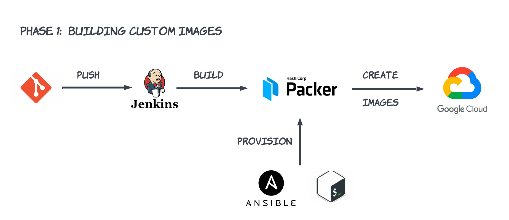

# A Self healing application deployed using custom MI
The goal of this project is to deploy a self healing appication across multiple zones in a single region which includes features such as autoscalling and health checks. I will be using a simple java application for this project.
  
**Requirements:**
+ Google billing account
+ Java app which can be containerized and which also have a RDS
+ Have a basic understanding of cloud services

# Creating MI with Packer and Ansible/Shell:

***Why are we doing this?***

By pre-building machine images using Packer and provisioner (Here i used shell script) , you have ready-to-use images that contain your application and configurations. When autoscaling, these pre-baked images can be launched much faster than provisioning instances from scratch. This reduces the time it takes to add new instances to your environment, minimizing downtime.

**Packages to be Provisioned:**
+  [Docker](https://docs.docker.com/get-docker/)
+  [Git](https://git-scm.com/downloads)
+  [Cloud ops agent](https://cloud.google.com/stackdriver/docs/solutions/agents/ops-agent)
  

***Install the following on a VM Instance:***
+ [Jenkins ***( Latest refer docs )***](https://www.jenkins.io/download/)
+ [Git](https://git-scm.com/downloads)
+ [Packer ***(>v1.7.0)***](https://www.packer.io/) # so the packer supports init

**Steps:**
1. Configure an VM and Install the above packages.
2. Configure an firewall rule named ***allow-jenkins*** to enable tcp-connection on port 8080.
3. Create a repository named ***packer*** (ur name) and upload ur Jenkinsfile,*.pkr.hcl file and provisioner.sh file (If you are using ansible, upload ur playbook file instead) 
4. Once you setup the Jenkinsfile, Navigate to ***http://[ExternalIP]:8080*** to access the Jenkins server.
5. Create a Jenkins CI Pipeline with the packer repository using git SCM. Make sure to change Braches to build option to ***main*** like this
   
 
***NOTE: Dont store ur Cloud credentials/secrets on any public repository. In this Demo I used Jenkins Credentials to store the Secrets of my gcp service account.***

# Currently working on phase 2 ( I will update this repo once the project is done)

